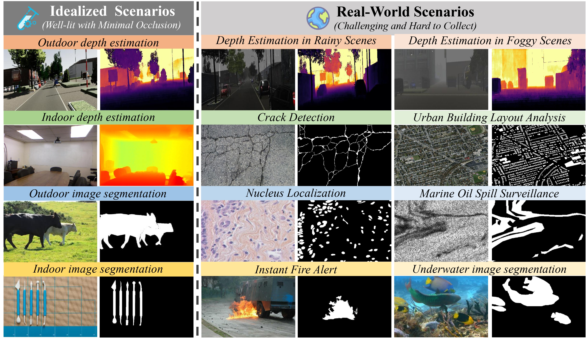
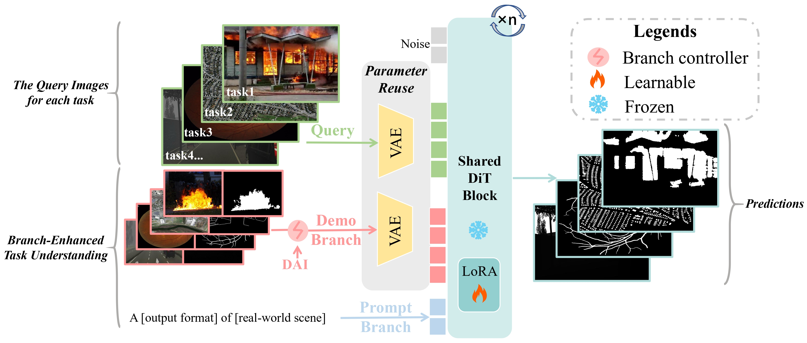
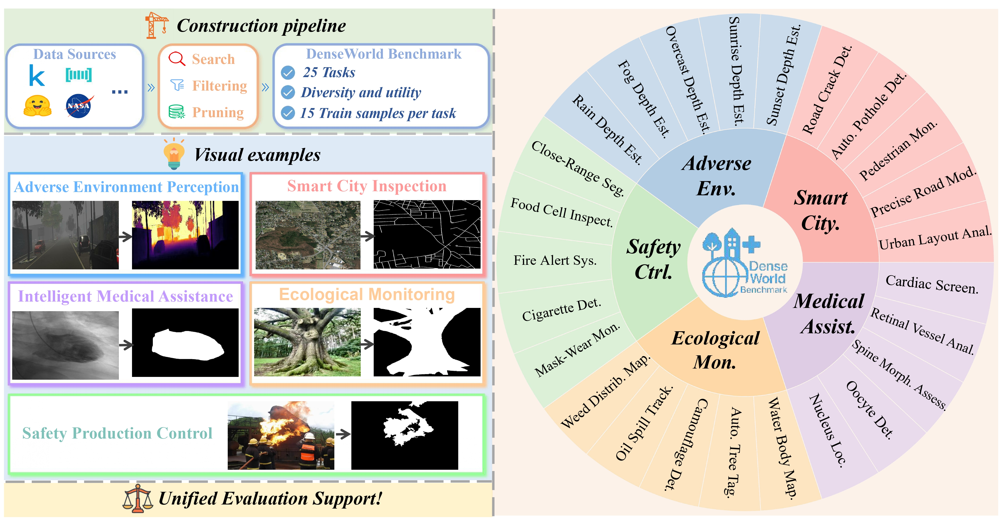

<h1 align="center">
From Ideal to Real: Unified and Data-Efficient Dense Prediction for Real-World Scenarios
</h1>
<p align="center">
  <a href="https://xcltql666.github.io/DenseDiTProj/"><b>[🌐 Website]</b></a> •
  <a href="https://arxiv.org/abs/2506.20279"><b>[📜 Paper]</b></a> •
  <a href="https://huggingface.co/xcll/DenseDiT_Model"><b>[🤗 HF Models]</b></a> •  
  <a href="https://huggingface.co/datasets/xcll/DenseWorld_Benchmark"><b>[🤗 HF Dataset]</b></a> •  
</p>


<p align="center">
Repo for "<a href="https://arxiv.org/abs/2506.20279" target="_blank">From Ideal to Real: Unified and Data-Efficient Dense Prediction for Real-World Scenarios</a>"
</p>



## DenseDiT Model


## DenseWorld Benchmark


##  News

- _2025.06_:  We release the <a href="https://huggingface.co/datasets/xcll/DenseWorld_Benchmark"><b>[DenseWorld Benchmark]</b></a>.

- _2025.06_:  We release the checkpoints of the <a href="https://huggingface.co/xcll/DenseDiT_Model"><b>[DenseDiT model]</b></a> for all of 25 tasks in the DenseWorld Benchmark.


## Installation
Create a virtual environment and install the required dependencies:
```bash
conda create -n densedit python=3.12
conda activate densedit
pip install -r requirements.txt
```

## Training
> 📌 For tasks in DenseWorld:
> - If the **DAI** label is **No**, use the code in ```DenseDiT_dai_no/```.
> - If the **DAI** label is **Yes**, use the code in ```DenseDiT_dai_yes/```.

1. Make sure to set the correct paths in ```train.py``` and ```callbacks.py```.
2. Specify the wandb API key in ```train_densedit.sh``` (Optional).
3. Start training
```bash
bash train/scripts/train_densedit.sh
```

## Inference
> 👀 Note: For visualization inference results of the 25 DenseWorld tasks only, please contact us directly.
1. Make sure to set the correct paths in ```inference.py```.
2. Start inference
```bash
python inference.py
```

## Acknowledgment
  Thanks to <a href="https://huggingface.co/black-forest-labs/FLUX.1-dev" target="_blank">FLUX.1-dev</a> for their powerful model, <a href="https://github.com/ali-vilab/In-Context-LoRA" target="_blank">IC-LoRA</a> for discovering the in-context capability of FLUX, and <a href="https://github.com/Yuanshi9815/OminiControl" target="_blank">OminiControl</a> for their wonderful open-sourced work.

## Citation
If you find it helpful, please kindly cite the paper.
```
@misc{xia2025idealrealunifieddataefficient,
      title={From Ideal to Real: Unified and Data-Efficient Dense Prediction for Real-World Scenarios}, 
      author={Changliang Xia and Chengyou Jia and Zhuohang Dang and Minnan Luo},
      year={2025},
      eprint={2506.20279},
      archivePrefix={arXiv},
      primaryClass={cs.CV},
      url={https://arxiv.org/abs/2506.20279}, 
    }
```

## 📬 Contact

If you have any inquiries, suggestions, or wish to contact us for any reason, we warmly invite you to email us at 202066@stu.xjtu.edu.cn or cp3jia@stu.xjtu.edu.cn.
